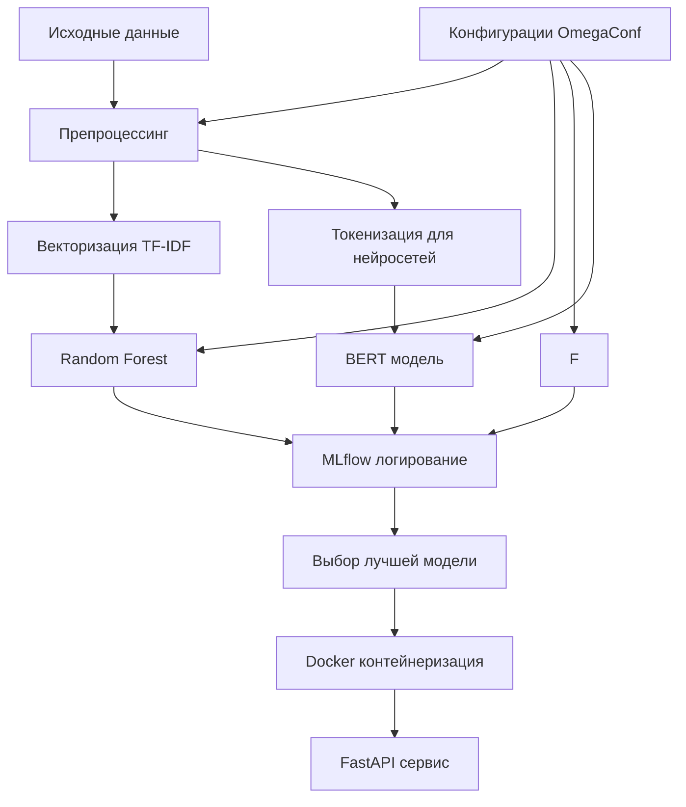
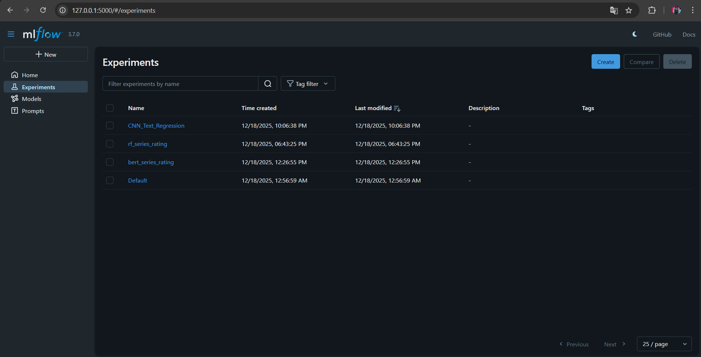
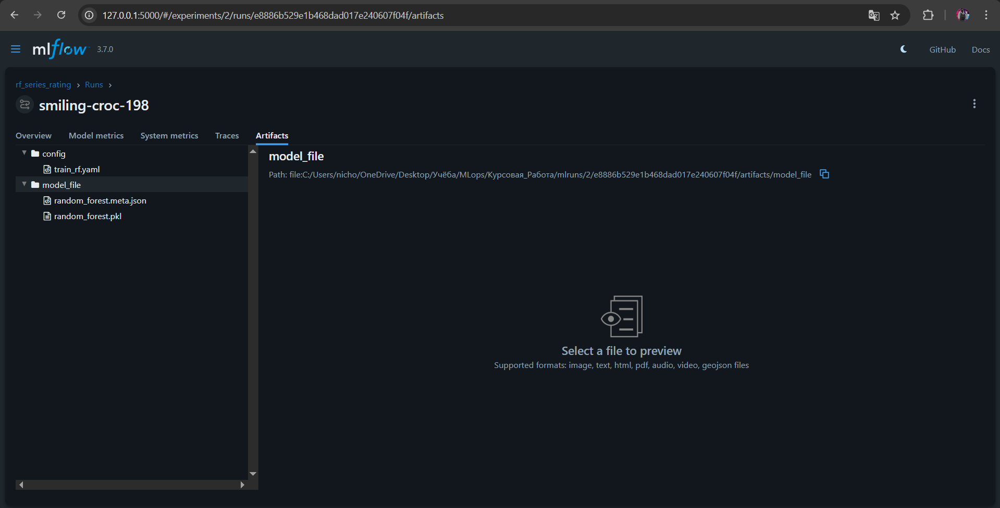
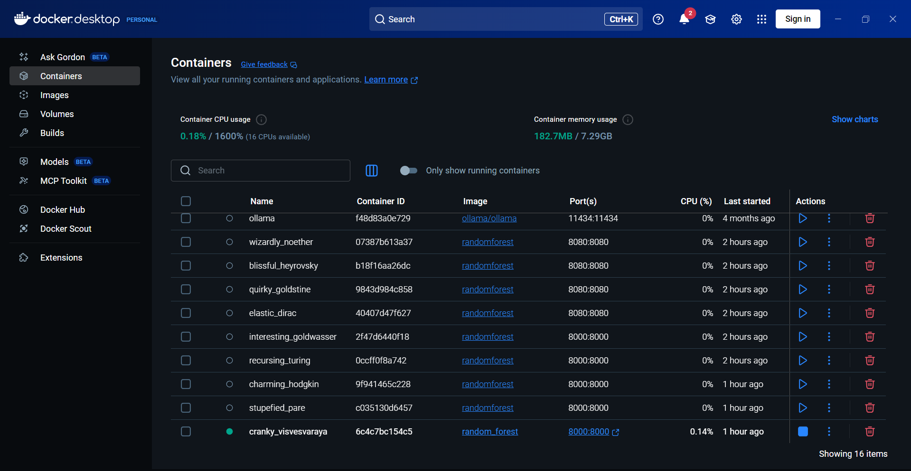
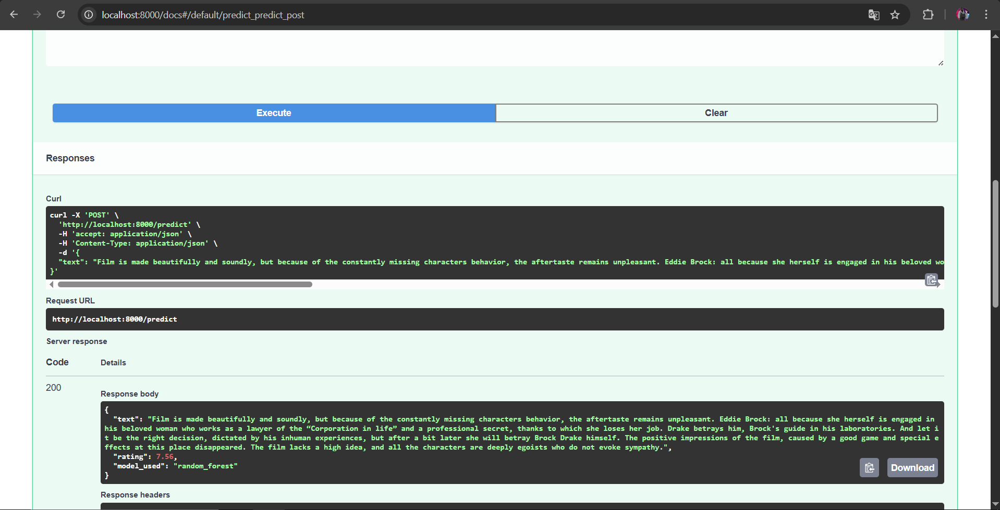

# 🎬 MLOps пайплайн для прогнозирования рейтинга сериалов по отзывам

🌟 **Описание проекта**

Данный проект представляет собой полнофункциональный MLOps-пайплайн для задачи регрессии текстовых данных — предсказания числового рейтинга сериала на основе пользовательского текстового отзыва.

В рамках работы реализован полный жизненный цикл модели машинного обучения:
от подготовки данных и обучения нескольких моделей до логирования экспериментов, контейнеризации и развёртывания инференс-сервиса в виде FAST API.

Проект демонстрирует практическое применение принципов операционализации машинного обучения (MLOps) и охватывает ключевые аспекты промышленного ML-разработки:
- воспроизводимость экспериментов;
- управление конфигурациями;
- версионирование моделей и данных;
- мониторинг метрик;
- удобный доступ к модели через API.


---

## ✨ Особенности проекта

- **End-to-End MLOps пайплайн**: от данных до продакшн-сервиса
- **Сравнение трёх архитектур**: классический ML и BERT
- **Профессиональное логирование**: MLflow для воспроизводимости экспериментов
- **Промышленное развёртывание**: Docker + FastAPI REST API
- **Полная документация**: Swagger, README
- **Конфигурационное управление**: OmegaConf для управления параметрами

## 🏗️ Архитектура решения



## 🛠️ Стек технологий

**Машинное обучение:**
- `scikit-learn` - Random Forest, TF-IDF
- `transformers` - BERT модель
- `pandas`, `numpy` - обработка данных

**MLOps инфраструктура:**
- `MLflow` - трекинг экспериментов
- `OmegaConf` - управление конфигурациями
- `DVC` - версионирование данных

**Развёртывание:**
- `FastAPI` - REST API сервер
- `Docker` - контейнеризация
- `uvicorn` - ASGI сервер


---

## 🧠 Модели машинного обучения

Для решения задачи реализованы и сравнены три принципиально разные архитектуры, что позволяет наглядно продемонстрировать различия между классическими ML-подходами и современными нейросетевыми моделями:

### 1. **Random Forest + TF-IDF**
Классический ансамблевый алгоритм машинного обучения, использующий статистическое представление текста.
Обеспечивает высокую интерпретируемость и стабильные результаты.

**Особенности:**
- Векторизация текста через TF-IDF
- 100 деревьев в ансамбле
- Grid Search для подбора гиперпараметров

### 2. **BERT (Transformer-based модель)**
Предобученная языковая модель из библиотеки HuggingFace Transformers, дообученная для задачи регрессии.
Используется для оценки качества глубоких контекстных представлений текста.

**Особенности:**
- Модель: `bert-base-uncased`
- Fine-tuning на задаче регрессии
- Learning rate: 2e-5, Batch size: 16

---

## 🚀 Быстрый старт


1. **Запуск обучения моделей:**
```bash
# Обучение всех моделей
python src/train.py

# Обучение конкретной модели
python src/train.py model=random_forest
python src/train.py model=bert
```

2. **Запуск MLflow UI для просмотра экспериментов:**
```bash
mlflow ui
```
Откройте http://localhost:5000 в браузере.  

<br><br>




### Запуск через Docker

1. **Сборка Docker образа:**
```bash
docker build -t random_forest .
```

2. **Запуск контейнера:**
```bash
docker run -p 8000:8000 random_forest
```

---
3. **Открыть UI:**
    http://localhost:8000/docs

!

---

## 🔬 Эксперименты и MLOps-подход

Все этапы обучения моделей сопровождаются логированием в MLflow, включая:
- гиперпараметры моделей;
- метрики качества (MAE, RMSE, R²);
- сохранение моделей как артефактов;
- фиксацию конфигураций и версий библиотек.

Это позволяет:
- воспроизводить эксперименты;
- сравнивать модели между собой;
- отслеживать влияние гиперпараметров и препроцессинга.

### Конфигурационное управление (OmegaConf)
```yaml
model:
  name: "bert"
  params:
    learning_rate: 2e-5
    batch_size: 16
    epochs: 3
    
data:
  train_size: 0.8
  random_state: 42
  
preprocessing:
  max_words: 10000
  max_length: 200
```

---

---

## 🎯 Итог

Проект демонстрирует комплексный подход к построению ML-системы, ориентированной не только на качество модели, но и на:
- удобство эксплуатации,
- масштазируемость,
- воспроизводимость,
- соответствие MLOps-практикам.

Работа полностью соответствует требованиям курсового проекта по дисциплине «Операционализация моделей машинного обучения (MLOps)» и может рассматриваться как пример end-to-end ML-решения.

---